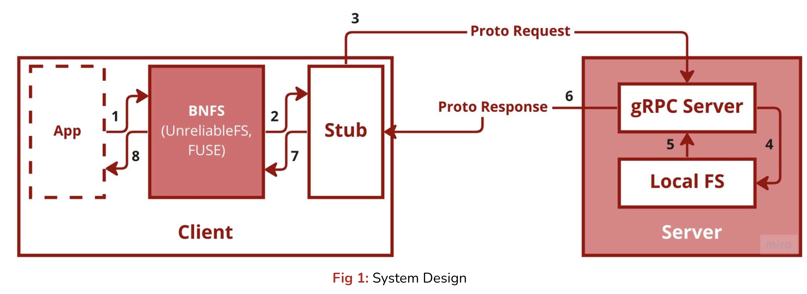

# BNFS (Basic Network File System)
An AFS-like filesystem built with FUSE & gRPC
* Close-to-open semantics, Last-writer-wins
* Volatile Temp cache and persistent Cache on client
* Atomic writes on server
* Streamed gRPC read/write calls
* Supports most FS operations ls, mv, cp, touch, mkdir, vi, etc  
* Retry based recovery for clients. No state on server
* Hash based identification of files in client Cache
* Consistency guarantees via Temp on client (plus offline operation possible)

## Navigating branches
The `main` branch contains code for our network file system (BNFS) including the consistency and durability tests. This code includes some hooks made to run the durability test by reordering writes and closes using `alice_errinj` and `alice_reorder` including logs and a thread that polls the incoming requests to queue them. This is not an optimized version of our file system. To find a version of BNFS without the durability and consistency tests, please look at the `demo_branch` branch.

## Building

This builds all the required repo.
Run `bash init.sh` 

This builds the server and client executables at ./unreliablefs/build/unreliablefs/
Run `source ./unrealiablefs/compile.sh`

Run server and client executable in separate sh terminals.
Run `./afs_server`
Run `mkdir mnt`
Run `./unreliablefs mnt -d -basedir=/`
